# Airport Risk Intelligence
**Reply × LUISS 2026 — Project 2 (Classical vs Multi-Agent)**

Team: Daniele Giovanardi · Filippo Nannucci · Edoardo Riva.

---

## What we built

Reply asked us to build an anomaly-detection system on NoiPA airport-security data and to argue which architecture is more convenient. We built the same detection logic twice:

1. a **classical pipeline**, organised as seven sequential steps (EDA → preprocessing → feature engineering → baseline → ensemble → post-processing → evaluation), inlined inside `main.ipynb` so that a reviewer can read it top-to-bottom without leaving the notebook;
2. a **multi-agent LangGraph system** with five specialised agents (Data, Baseline, Outlier, RiskProfiling, Report) plus an optional `Supervisor` verifier wired into the graph as a conditional branch. This pipeline lives in the `multiagent_pipeline/` Python library and is imported by Sections 8 and 10–12 of `main.ipynb`.

Both pipelines share the same preprocessing module, the same feature builder, the same MAD-based baseline, the same business rules and the same ensemble weights. The only real difference is the orchestration layer: a sequential script vs a LangGraph DAG with four data-driven conditional edges (one of them a feedback cycle bounded by an iteration cap).

On the 567 routes of NoiPA data the two pipelines produce **the same risk distribution** (17 ALTA, 40 MEDIA, 510 NORMALE) and **agree on 557 of 567 labels (98.24 %)**. Convergence is the point of the brief: it shows that both implementations are correct. The 10 residual disagreements (1.76 %) all sit at the MEDIA / NORMALE boundary and are driven entirely by the stochastic Autoencoder.

---

## The data

The dataset comes from **NoiPA**, the Italian airport border-control system. Two raw CSVs:

| File | Content |
|------|---------|
| `ALLARMI.csv` | One row per alarm (Interpol, SDI, NSIS) generated by a control, with motive, outcome (chiuso, respinto, fermato, segnalato), year-month. |
| `TIPOLOGIA_VIAGGIATORE.csv` | One row per traveller-profile transit on a route-month: total entered, alarmed, investigated. |

The unit of analysis is the **route**: an `airport_partenza → airport_arrivo` pair (e.g. `CMN-FCO` for Casablanca → Rome Fiumicino). After cleaning, merging and aggregating monthly we obtain **567 unique routes** described by **54 numerical features** each.

The raw CSVs are confidential and are **not redistributed** in this repository. They are provided directly by Reply to the reviewing committee.

---

## Architecture

The graph carries four data-driven conditional edges, plus the standard error-stop logic on each transition:

1. **after_baseline** — skip the ML stack when the baseline signal is degenerate (fewer than 5 features available or `baseline_score` std below 0.01) and terminate early.
2. **after_outlier** — route through `SupervisorAgent` only when the first pass produces at least 5 ALTA labels; otherwise the graph short-circuits to the rule layer.
3. **after_supervisor** — *cycle back* to `OutlierAgent` when the supervisor downgrades more than 50 % of the first-pass ALTA labels, capped at two iterations to guarantee termination. The one place where the topology is genuinely non-linear.
4. **after_risk** — skip the LLM `ReportAgent` when there are no ALTA/MEDIA routes worth narrating, saving API cost on quiet perimeters.

### The five agents (plus the verifier)

| # | Agent | Responsibility |
|---|-------|----------------|
| 1 | `DataAgent` | Loads `ALLARMI` + `TIPOLOGIA_VIAGGIATORE`, applies the user-defined perimeter, and engineers 54 numerical features per route via `FeatureBuilder`. |
| 2 | `BaselineAgent` | Robust MAD z-scores per `BASELINE_FEATURE` → composite `baseline_score` (mean of absolute z) consumed as the Z-component of the OutlierAgent ensemble. |
| 3 | `OutlierAgent` | 4-model weighted ensemble (real `sklearn` IF + LOF + Z + Autoencoder) → `ensemble_score` and `risk_label` (ALTA / MEDIA / NORMALE). |
| 4 | `RiskProfilingAgent` | Five business rules → `confidence` (60 % ML + 40 % rules) → `final_risk` (CRITICO / ALTO / MEDIO / BASSO) + per-route `risk_drivers`. |
| 5 | `ReportAgent` (LLM) | Optional Claude narrative for each ALTA/MEDIA route, citing top z-score drivers and the business rules that fired. |
| ★ | `SupervisorAgent` *(verifier, opt-in)* | Re-fits IsolationForest at contamination = 3 % on the ALTA subset and tags `alta_robusta = True` only for routes that survive the stricter rule. |

```mermaid
flowchart LR
    U([User perimeter<br/>year · country · airport · zone]) --> D
    D[DataAgent<br/>load · filter · 54 features] --> B
    B[BaselineAgent<br/>MAD z-scores → baseline_score]
    B -- "n_features ≥ 5<br/>std ≥ 0.01" --> O[OutlierAgent<br/>IF · LOF · Z · AE]
    B -- "baseline degenerate" --> END([end])
    O -- "first-pass ALTA ≥ 5" --> S[SupervisorAgent<br/>strict refit · alta_robusta]
    O -- "first-pass ALTA &lt; 5" --> R
    S -- "downgrade ≤ 50 %" --> R[RiskProfilingAgent<br/>5 business rules → final_risk]
    S -- "downgrade > 50 % · iter &lt; 2" --> O
    R -- "ALTA/MEDIA" --> RP[ReportAgent<br/>LLM narrative]
    R -- "no anomalies" --> END
    RP --> END
    classDef det fill:#e0f2fe,stroke:#0284c7,color:#0c4a6e
    classDef ver fill:#fef3c7,stroke:#d97706,color:#78350f
    classDef llm fill:#f3e8ff,stroke:#9333ea,color:#581c87
    class D,B,O,R det
    class S ver
    class RP llm
```



---

## Results

After running both pipelines on the same 567 routes:

| Metric | Value |
|--------|-------|
| Same `anomaly_label` (ALTA / MEDIA / NORMALE) | **98.24 %** (557 / 567) |
| Distribution (ALTA / MEDIA / NORMALE) | **17 / 40 / 510** in BOTH pipelines |
| `ensemble_score` Pearson r | **0.9965** |
| `ensemble_score` Spearman ρ | **0.9979** |
| Per-model agreement: IsolationForest | **r = 1.0000** |
| Per-model agreement: LOF | **r = 1.0000** |
| Per-model agreement: Z-score (shared MAD) | **r = 1.0000** |
| Per-model agreement: Autoencoder | **r = 0.9663** (stochastic training) |
| Top-10 most-anomalous routes overlap | **9 / 10** |
| Top-50 most-anomalous routes overlap | **46 / 50** |


*Top 15 routes by ensemble anomaly score (multi-agent pipeline, weighted IF · LOF · Z · AE). All 15 fall above the p97 threshold and are tagged ALTA. Note the clear lead of CMN-BLQ (Casablanca → Bologna) at 0.700.*


*Both pipelines produce the same 17 / 40 / 510 distribution and agree on 557 / 567 labels. The 98.24 % point estimate is the convergence certificate between the two architectures.*


*Per-route correlation between the classical `anomaly_score` and the multi-agent `ensemble_score`. Pearson r = 0.9965, Spearman ρ = 0.9979. Points hug the y = x reference line; the residual scatter at the boundary is driven entirely by the stochastic Autoencoder.*

---

## How to run

### What you need

1. Python ≥ 3.10
2. The two raw CSVs **provided by Reply under NDA**:
   - `data/raw/ALLARMI.csv`
   - `data/raw/TIPOLOGIA_VIAGGIATORE.csv`
3. *(Optional)* an Anthropic API key, only if you want the LLM narratives in Section 8 of the notebook.

### Setup (3 commands)

```bash
git clone https://github.com/DanieleGiovanardi2408/ReplyxLuissproject-815601-.git
cd ReplyxLuissproject-815601-

# Create the virtual env and install the dependencies
python -m venv venv
source venv/bin/activate          # on Windows: venv\Scripts\activate
pip install -r requirements.txt
```

Then drop the two NDA-protected CSVs into `data/raw/`:

```
data/raw/
├── ALLARMI.csv
└── TIPOLOGIA_VIAGGIATORE.csv
```

### *(Optional)* enable the LLM narratives

```bash
cp .env.example .env
# Open .env and add: ANTHROPIC_API_KEY=sk-ant-...
```

Without a key, Section 8.2 of the notebook automatically falls back to a deterministic dry-run mode that produces template narratives and skips the API calls. All numerical results are unaffected.

### Run the project — single notebook, end to end

```bash
PYTHONPATH=. jupyter lab main.ipynb
```

Then `Run All`. The notebook is organised as **thirteen sections** that follow the actual workflow:

| Sec. | Topic | What it does |
|------|-------|--------------|
| 1 | EDA | Loads the two raw CSVs and inspects schemas and distributions |
| 2 | Preprocessing | Cleans + merges (date parsing, ISO2→ISO3 country codes, gender normalisation, sparse column drop, route-level merge) |
| 3 | Feature Engineering | Builds 54 numerical features per route |
| 4 | Baseline Construction | Robust MAD z-scores per `BASELINE_FEATURE` + composite `baseline_score` |
| 5 | Anomaly Detection | 4-model weighted ensemble (IF · LOF · Z · AE) with data-driven p97/p90 thresholds |
| 6 | Post-Processing | 5 business rules → confidence (60 % ML + 40 % rules) → final risk |
| 7 | Evaluation | Silhouette, bootstrap stability, feature importance, SHAP via surrogate |
| 8 | Multi-Agent Pipeline | `from multiagent_pipeline.main import run_pipeline` — runs the LangGraph DAG end-to-end |
| 9 | Comparative Analysis | Classical vs multi-agent: agreement, per-model correlation, top-K overlap |
| 10 | Bootstrap CI | 1 000 resamples at 80 % subsample to size the agreement metric |
| 11 | Threshold sensitivity | Perturbation of the five rule thresholds by ±20 % |
| 12 | Temporal coverage | Linear-trend slope per route as a 13-month-panel-friendly substitute for STL |
| 13 | Conclusions | When to choose which architecture, limits, future work |

End-to-end runtime on the 2024 perimeter (567 routes):
- **without the LLM** → ~2 minutes (notebook re-runs the classical pipeline inline + the multi-agent graph)
- **with the LLM** → ~7 minutes (Claude generates one narrative per ALTA/MEDIA route, ~57 calls)

---

## Repository structure

```
ReplyxLuissproject-815601-/
│
├── README.md
├── main.ipynb                              # Single-notebook tour of the project
├── Oral_presentation.pdf                   # Slides for the oral defense
├── requirements.txt
├── .gitignore
├── .env.example                            # ANTHROPIC_API_KEY template
│
├── images/                                 # Result charts shown above
│   ├── top_routes_anomaly_score.png
│   ├── risk_label_distribution.png
│   └── score_correlation_classical_vs_multiagent.png
│
├── shared/
│   └── preprocessing.py                    # Cleaning + merge layer used by both pipelines
│
└── multiagent_pipeline/                    # LangGraph library imported by the notebook
    ├── main.py                             # run_pipeline — graph orchestrator
    ├── state.py                            # AgentState schema + shared constants
    ├── config.py                           # API key + model config
    ├── agents/
    │   ├── data_agent.py                   # Loads, filters, feature-engineers
    │   ├── baseline_agent.py               # Robust MAD z-scores
    │   ├── outlier_agent.py                # 4-model weighted ensemble
    │   ├── supervisor_agent.py             # Strict refit on the ALTA subset (verifier)
    │   ├── risk_profiling_agent.py         # 5 business rules + final_risk
    │   └── report_agent.py                 # LLM narrative explanations
    ├── src/
    │   ├── features.py                     # FeatureBuilder
    │   ├── bootstrap_ci.py                 # Bootstrap CI on agreement / correlations
    │   ├── threshold_sensitivity.py        # ±20 % perturbation of the BR thresholds
    │   └── trend_analysis.py               # Linear trend slope per route
    ├── tests/
    │   ├── test_risk_profiling_agent.py    # 8 unit tests on the 5 business rules
    │   └── e2e_validation.py               # 5-perimeter end-to-end regression suite
    └── tools/
        └── data_tools.py                   # Perimeter filtering helpers
```

`main.ipynb` inlines the entire classical pipeline (Sections 1–7) so the reviewer can read it without jumping between files. The multi-agent code is kept as a library because re-implementing the LangGraph DAG inline would lose the agent modularity that makes the orchestration meaningful.

---

## Design rationale

Three choices we want to call out because they look like deviations from the brief but were the right call given the data we had.

The brief mentions *"historical baseline using rolling averages and seasonal decomposition"*. We tried it and stepped back. The dataset has only 13 months of observations and the median route appears in just 2 of them, so STL needs at least 12 observations per series and a rolling 3-month mean over 3 points collapses to the cross-sectional mean we already compute. Robust z-scores against the population are mathematically sounder for this sample size; we still added a per-route linear-trend slope (Section 12 of the notebook) to capture the temporal signal the dataset can actually support.

The brief lists *"IsolationForest, LOF or Z-score"*. We blend all four — IF 0.35, LOF 0.30, Z 0.15, Autoencoder 0.20 — because the autoencoder catches non-linear feature combinations the other three miss. It also degrades gracefully: with fewer than 30 normal samples the autoencoder is excluded and the remaining weights are renormalised, so small perimeters still produce a coherent score.

The Reply slide shows five agents (Data → Baseline → Outlier → Risk Profiling → Report). We respect the count exactly. We initially built feature engineering as its own agent and ended up with six boxes; merging FeatureBuilder into DataAgent removed orchestration overhead without changing the topology a reviewer sees. The `SupervisorAgent` is presented as a verifier rather than a sixth mandatory agent — Reply's spec asks for five.

Both pipelines use the same MAD z-score baseline (median ± 1.4826 · MAD per `BASELINE_FEATURE`), so the Z-component of the ensemble has Pearson r = 1.0000 between them by construction. Everything else — IsolationForest, LOF, Autoencoder, business rules, ensemble weights — is identical too.

---

## Limits

The whole evaluation runs on a single dataset. We have not stress-tested the pipelines on a different schema, although the `DataAgent` has an LLM schema-normalisation layer ready for the case (it has not had to fire on the NoiPA data because the canonical columns are all there). The temporal model we added (linear trend slope per route) is the most we can extract from a 13-month panel where most routes appear in 2–3 months; a longer panel would unlock STL and rolling means without changing the rest of the pipeline. The LLM narratives are reviewed in spot checks but not programmatically validated against a ground truth — the ReportAgent prompt forbids hallucination but we do not prove zero hallucination automatically.

## Future work

A `TrendAgent` as a sixth optional node would extend the linear slope to STL once panels become long enough. The supervisor → outlier feedback cycle currently widens the search when the verifier disagrees; a richer version could re-run on borderline ALTO routes too. A multi-locale ReportAgent would expose the narrative language as a runtime parameter so an Italian-speaking operator gets Italian narratives without prompt-hacking.

---

*Reply × LUISS 2026 — Daniele Giovanardi · Filippo Nannucci · Edoardo Riva*
