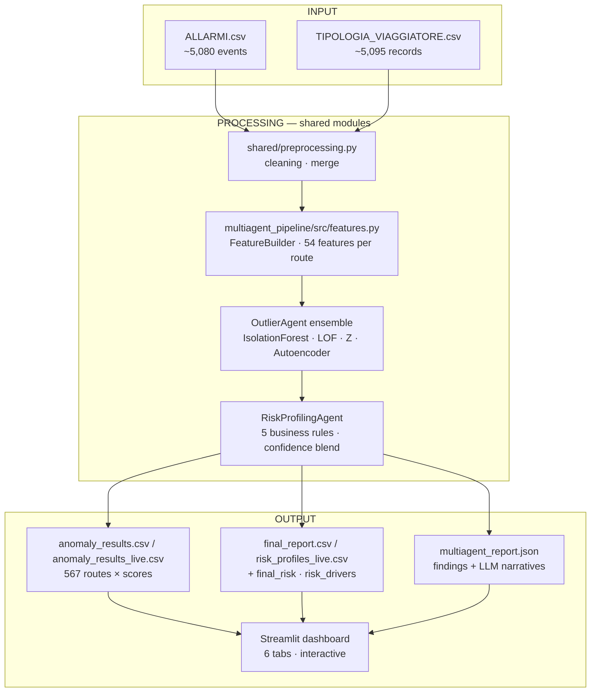

# Airport Risk Intelligence
**Reply × LUISS 2026 — Project 2 (Classical vs Multi-Agent)**

Team: Daniele Giovanardi, Filippo Nannucci, Edoardo Riva.

---

## What we built

Reply asked us to build an anomaly-detection system on NoiPA airport-security data and to argue which architecture is more convenient. We built the same detection logic twice:

1. a **classical pipeline**, six step-by-step notebooks driven by `classical_pipeline/main.py`,
2. a **multi-agent LangGraph system** with five specialised agents (Data, Baseline, Outlier, RiskProfiling, Report) plus an optional `Supervisor` verifier wired into the graph as a conditional branch.

Both pipelines share the same preprocessing module, the same `FeatureBuilder`, the same MAD-based baseline, the same business rules and the same ensemble weights. The only real difference is the orchestration layer: a linear script vs. a LangGraph DAG with four data-driven conditional edges (one of them a feedback cycle bounded by an iteration cap).

On the 567 routes of NoiPA data the two pipelines produce **the same risk distribution** (17 ALTA, 40 MEDIA, 510 NORMALE) and **agree on 557 of 567 labels (98.2%)**. The 95% bootstrap CI on that agreement is stable over 1 000 resamples at 80%. This convergence is the point of the brief: it shows that both implementations are correct, and the 10 residual disagreements (~1.8%) all sit at the MEDIA/NORMALE boundary where IF/LOF/AE re-rank borderline routes differently across runs.

`main.ipynb` at the repo root is the executable end-to-end story. Reading it top to bottom is enough to see the whole project; the rest of the repo is the supporting library.

---

## The problem

Italian border control generates a lot of data: every passenger transit, every alarm, every document check. Most of it goes unused.

We look at **routes** (pairs `departure_airport → arrival_airport`, e.g. `CAI-FCO` for Cairo→Rome Fiumicino) and ask: is this route behaving anomalously compared with the rest of the population?

We flag routes with unusual combinations of:

- high alarm rates (Interpol, SDI, NSIS),
- high investigation and rejection rates,
- low closure rates,
- unusual traveller profiles.

The output is a risk label per route (ALTA = above the p97 cut on the ensemble score, i.e. top 3 %; MEDIA = between p90 and p97, the next 7 %; NORMALE = the remaining 90 %) plus a final business-rule classification CRITICO / ALTO / MEDIO / BASSO that blends the ML score (60 %) with the business-rule score (40 %).

---

## Why two architectures

### Classical pipeline

We started classically because it forced us to look at the data step by step. Six notebooks (EDA, feature engineering, baseline construction, anomaly detection, post-processing, evaluation) take us from the raw CSVs to 54 features per route, a robust MAD z-score baseline (median ± 1.4826·MAD per BASELINE_FEATURE, with a Tukey-IQR audit layer kept alongside as a per-feature explanation aid), and a weighted ensemble of IsolationForest, LOF, a Z-score signal and a small Autoencoder. End-to-end the pipeline runs in roughly three seconds.

Its main limit is rigidity. If an analyst wants the same analysis on a different time window or on one country alone, the whole pipeline must be re-run.

### Multi-agent version

The LangGraph version implements the same detection logic as a graph of five specialised agents. The numbers it produces are identical to the classical pipeline; what we gain is architectural.

*Dynamic perimeter filtering.* The `DataAgent` accepts `{anno, paese, aeroporto, zona}` at runtime and only the matching subset of the data flows through the graph. Section 8.9.1 of the notebook runs three country queries (Algeria, Marocco, Turchia) end-to-end in roughly one second each.

*LLM explanations.* The `ReportAgent` uses Claude to write a plain-English narrative for every anomalous route. A typical output reads: *"Route CMN-BLQ flags ALTA: pct_interpol = 0.43 (+2.4σ above the population baseline) and tasso_respinti = 0.30 (+1.8σ); the High INTERPOL alarm rate and Multi-source alarm rules both fired. Final risk: CRITICO (confidence 0.74)."*

*Modular re-evaluation.* Changing a business-rule threshold re-runs only the `RiskProfilingAgent` in about ten milliseconds. The classical pipeline would re-run preprocessing, feature engineering, baseline and ensemble for the same effect.

*Deterministic when needed.* Pass `run_report=False` and the multi-agent skips Claude entirely, producing the same numerical output as the classical pipeline in roughly 1.3 seconds.

The trade-off is complexity: a classical pipeline is easier to debug, and a multi-agent system is more flexible at the cost of an extra orchestration layer.

The five agents (Reply spec topology):

| # | Agent | Responsibility |
|---|-------|---------------|
| 1 | `DataAgent` | Loads `ALLARMI` + `TIPOLOGIA_VIAGGIATORE`, applies the user-defined perimeter, and engineers 54 numerical features per route via `FeatureBuilder` (the same shared module the classical pipeline calls inline). |
| 2 | `BaselineAgent` | Robust MAD z-scores per BASELINE_FEATURE → composite `baseline_score` (mean of absolute z) consumed as the Z-component of the OutlierAgent ensemble. |
| 3 | `OutlierAgent` | 4-model weighted ensemble (real `sklearn` IF + LOF + Z + Autoencoder, where Z = BaselineAgent's `baseline_score`) → `ensemble_score` and `risk_label` (ALTA/MEDIA/NORMALE). |
| 4 | `RiskProfilingAgent` | Five business rules → `confidence` (60% ML + 40% rules) → `final_risk` (CRITICO/ALTO/MEDIO/BASSO) + per-route `risk_drivers`. |
| 5 | `ReportAgent` (LLM) | Optional Claude narrative for each ALTA/MEDIA route, citing top z-score drivers and the business rules that fired. Skipped automatically when no anomalies remain after profiling. |
| ★ | `SupervisorAgent` *(verifier, opt-in)* | Re-fits IsolationForest at contamination = 3 % on the ALTA subset and tags `alta_robusta = True` only for routes that survive the stricter rule. Activated by the `after_outlier` conditional edge when the first pass produces ≥ 5 ALTA labels; otherwise the graph short-circuits to RiskProfiling. |

Feature engineering lives inside `DataAgent` rather than in its own agent: it is a deterministic transformation of the same filtered data, and giving it a separate agent box would push the visible count to six without adding orchestration value. The Supervisor is presented as a verifier rather than a sixth mandatory agent — Reply's spec asks for five.

### Architecture map

```mermaid
flowchart LR
    U([User perimeter<br/>year · country · airport · zone]) --> D
    D[DataAgent<br/>load · filter · 54 features] --> B
    B[BaselineAgent<br/>MAD z-scores → baseline_score]
    B -- "n_features ≥ 5<br/>std ≥ 0.01" --> O[OutlierAgent<br/>IF · LOF · Z · AE → ensemble_score<br/>risk_label]
    B -- "baseline degenerate" --> END([end])
    O -- "first-pass ALTA ≥ 5" --> S[SupervisorAgent<br/>strict refit · alta_robusta]
    O -- "first-pass ALTA &lt; 5" --> R
    S -- "downgrade ≤ 50 %" --> R[RiskProfilingAgent<br/>5 business rules → br_score<br/>final_risk + risk_drivers]
    S -- "downgrade > 50 % · iter &lt; 2" --> O
    R -- "ALTA/MEDIA" --> RP[ReportAgent<br/>LLM narrative]
    R -- "no anomalies" --> END
    RP --> END
    classDef det fill:#e0f2fe,stroke:#0284c7,color:#0c4a6e
    classDef ver fill:#fef3c7,stroke:#d97706,color:#78350f
    classDef llm fill:#f3e8ff,stroke:#9333ea,color:#581c87
    class D,B,O,R det
    class S ver
    class RP llm
```



### Data flow (input → processing → output)



### What we found

After running both pipelines on the same 567 routes:

| Metric | Value |
|--------|-------|
| Same `anomaly_label` (ALTA/MEDIA/NORMALE) | **98.2 %** (557/567) |
| Distribution (ALTA / MEDIA / NORMALE) | **17 / 40 / 510** in BOTH pipelines |
| `ensemble_score` Pearson r | **0.9965** |
| `ensemble_score` Spearman ρ | **0.9980** |
| Per-model agreement: IsolationForest | **r = 1.0000** |
| Per-model agreement: LOF | **r = 1.0000** |
| Per-model agreement: Z-score | **r = 1.0000** (MAD baseline shared end-to-end — see *Design choices*) |
| Per-model agreement: Autoencoder | **r = 0.9663** (stochastic training) |
| Top-10 most-anomalous routes overlap | **9 / 10** |
| Top-50 most-anomalous routes overlap | **46 / 50** |

So the two architectures converge on the same answer. The multi-agent version reaches it with more operational flexibility (runtime filtering, route-by-route explanations, modular failure handling); the classical pipeline reaches it faster and with simpler audit trails.

The notebook `notebooks/07_comparison_classical_vs_multiagent.ipynb` contains the full quantitative comparison, including confusion matrix, score correlation, rank-delta distribution, and final recommendation.

---

## Results

The three images below summarise the deliverable: which routes get flagged, how the two pipelines agree on the labels, and how their numerical scores correlate route-by-route.


*Top 15 routes by ensemble anomaly score (multi-agent pipeline, weighted IF · LOF · Z · AE). All 15 fall above the p97 threshold and are tagged ALTA. Note the clear lead of CMN-BLQ (Casablanca → Bologna) at 0.700.*


*Both pipelines produce the same 17 / 40 / 510 distribution and agree on 557 / 567 labels. The 98.24 % point estimate is the convergence certificate between the two architectures.*


*Per-route correlation between the classical `anomaly_score` and the multi-agent `ensemble_score`. Pearson r = 0.9965, Spearman ρ = 0.9979. Points hug the y = x reference line; the residual scatter at the boundary is driven entirely by the stochastic Autoencoder.*

---

## Project structure

```
classical-vs-multiagent/
│
├── README.md
├── main.ipynb                          # Single-notebook tour of the project
├── requirements.txt
├── .env.example                        # ANTHROPIC_API_KEY template
│
├── images/                             # Result charts (regenerable via scripts/build_result_images.py)
│   ├── top_routes_anomaly_score.png
│   ├── risk_label_distribution.png
│   └── score_correlation_classical_vs_multiagent.png
│
├── data/
│   ├── raw/                            # Source CSVs (gitignored — confidential)
│   │   ├── ALLARMI.csv
│   │   └── TIPOLOGIA_VIAGGIATORE.csv
│   └── processed/                      # Pipeline outputs (gitignored)
│
├── classical_pipeline/                 # ── Pipeline 1 ──────────────────────
│   ├── main.py                         # End-to-end orchestrator (single script)
│   └── notebooks/
│       ├── 01_EDA.ipynb
│       ├── 02_feature_engineering.ipynb
│       ├── 03_baseline_construction.ipynb
│       ├── 04_anomaly_detection.ipynb
│       ├── 05_post_processing.ipynb
│       └── 06_evaluation.ipynb
│
├── multiagent_pipeline/                # ── Pipeline 2 (LangGraph, 5 agents) ──
│   ├── main.py                         # Graph orchestrator
│   ├── state.py                        # Shared AgentState schema
│   ├── config.py                       # API key + model config
│   ├── agents/
│   │   ├── data_agent.py               # Loads, filters and feature-engineers
│   │   ├── baseline_agent.py           # Robust MAD z-scores
│   │   ├── outlier_agent.py            # 4-model weighted ensemble
│   │   ├── supervisor_agent.py         # Strict refit on the ALTA subset (verifier)
│   │   ├── risk_profiling_agent.py     # 5 business rules + final_risk
│   │   └── report_agent.py             # LLM narrative explanations
│   ├── src/
│   │   └── features.py                 # FeatureBuilder (shared with classical)
│   ├── tools/
│   │   └── data_tools.py               # Perimeter filtering helpers
│   └── tests/
│       ├── e2e_validation.py           # 5-perimeter regression suite
│       └── test_risk_profiling_agent.py  # 8 unit tests on business rules
│
├── shared/
│   └── preprocessing.py                # Data cleaning used by both pipelines
│
├── streamlit_app/                      # ── Dashboard ────────────────────────
│   ├── app.py                          # Streamlit application (6 tabs)
│   └── agent_graph.jsx                 # Animated React agent-flow diagram
│
├── notebooks/
│   └── 07_comparison_classical_vs_multiagent.ipynb   # The head-to-head
│
└── docs/
    └── Reply_projects.pdf              # Original brief from Reply
```

---

## How to run it

### Setup

```bash
git clone https://github.com/DanieleGiovanardi2408/classical-vs-multiagent.git
cd classical-vs-multiagent
python -m venv venv && source venv/bin/activate
pip install -r requirements.txt
```

### Data source and reproducibility

The raw inputs (`ALLARMI.csv`, `TIPOLOGIA_VIAGGIATORE.csv`) are real **NoiPA** airport transit and security-alert data, provided by Reply for the LUISS 2026 challenge under a confidentiality agreement. They are **not redistributed** in this repository (`data/raw/` is in `.gitignore`).

> ⚠️ **Cannot be reproduced without the raw CSVs.** Without the original Reply-provided files in `data/raw/`, neither pipeline can run. The `data/processed/*.csv` artefacts shipped with the repo are committed only as evidence of past runs; they are gitignored under fresh clones. Contact the team or Reply for access to the raw inputs.

If you have the two CSVs, place them as:
```
data/raw/ALLARMI.csv
data/raw/TIPOLOGIA_VIAGGIATORE.csv
```

### Quickest start — run the whole story in one notebook

```bash
PYTHONPATH=. jupyter lab main.ipynb
```

`main.ipynb` is the executable end-to-end story of the project. It is structured as thirteen sections matching the workflow we actually followed:

1. **Exploratory Data Analysis** — content of `classical_pipeline/notebooks/01_EDA.ipynb`
2. **Data Preprocessing** — `shared/preprocessing.py` inlined: the cleaning + merge layer used by **both** pipelines (date parsing, ISO2→ISO3 country codes, gender normalisation, sparse column drop, route-level merge)
3. **Feature Engineering** — content of `02_feature_engineering.ipynb`
4. **Baseline Construction** — content of `03_baseline_construction.ipynb`
5. **Anomaly Detection** — content of `04_anomaly_detection.ipynb`
6. **Post-Processing & Risk Profiles** — content of `05_post_processing.ipynb`
7. **Evaluation** — content of `06_evaluation.ipynb`
8. **Multi-Agent Pipeline** — the five LangGraph agents (plus the Supervisor verifier) inlined from `multiagent_pipeline/`
9. **Comparative Analysis** — content of `notebooks/07_comparison_classical_vs_multiagent.ipynb`
10. **Bootstrap confidence intervals** — 1 000 resamples at 80 % subsample to size the agreement metric and the per-component correlations
11. **Business-rule threshold sensitivity** — perturbation of the five rule thresholds by ±20 % and impact on `final_risk`
12. **Temporal coverage and per-route trend slopes** — linear-trend slope per route as a 13-month-panel-friendly substitute for STL
13. **Conclusions** — when to choose which architecture, limits, future work

The original step-by-step notebooks remain in the repo for those who want to drill into a single phase; the multi-agent code remains in `multiagent_pipeline/` because the Streamlit dashboard and the LangGraph orchestrator import it as a library; `shared/preprocessing.py` keeps the cleaning logic in one place so the classical script and the multi-agent `DataAgent` share the same source of truth.

### Classical pipeline

Run everything end-to-end:
```bash
PYTHONPATH=. python classical_pipeline/main.py --skip-eval     # ~3 s
PYTHONPATH=. python classical_pipeline/main.py                 # ~30 s incl. evaluation step
```

Or open the notebooks in order for the step-by-step walkthrough:
```bash
jupyter lab classical_pipeline/notebooks/
```

### Multi-agent pipeline

```python
from multiagent_pipeline.main import run_pipeline

# Without LLM (no API key needed)
state, summary = run_pipeline({"anno": 2024}, run_report=False, save_outputs=True)
# -> state["df_risk"]:  567 routes × 92 columns (incl. final_risk + risk_drivers)
# -> state["risk_meta"]["n_critico"], ["n_alto"], ["n_medio"], ["n_basso"]

# With LLM explanations (needs ANTHROPIC_API_KEY in .env)
state, summary = run_pipeline(
    {"anno": 2024},
    run_report=True,
    use_llm=True,
    save_outputs=True,
)
print(state["report"]["summary"])
```

### Comparison notebook

After running both pipelines:
```bash
PYTHONPATH=. jupyter lab notebooks/07_comparison_classical_vs_multiagent.ipynb
```

### Validation suite

Two layers of tests sit alongside the pipelines:

```bash
# 8 unit tests on the RiskProfilingAgent business rules — sub-second
PYTHONPATH=. python -m pytest multiagent_pipeline/tests/test_risk_profiling_agent.py -v

# 5-perimeter end-to-end regression (no LLM, ~3 s)
PYTHONPATH=. python multiagent_pipeline/tests/e2e_validation.py
# -> data/processed/multiagent_validation_report.json
```

### Dashboard (the nicest way to see everything)

```bash
streamlit run streamlit_app/app.py
```

Opens at `http://localhost:8501`. From here you can:
- Run the multi-agent pipeline with any filter combination
- See the agent graph animate as each of the 5 stages completes
- Explore the route map — click any route to see its risk details and the LLM explanation
- Compare classical vs multi-agent scores side by side

### LLM report (optional)

The `ReportAgent` calls Claude to generate plain-English explanations for each anomalous route. To enable it:

```bash
cp .env.example .env
# Add your key: ANTHROPIC_API_KEY=sk-ant-...
```

Then check **Enable LLM Report** in the dashboard sidebar before running. Without a key, use **Dry run** mode which runs the full pipeline but skips the API calls.

---

## Design rationale

A few choices we want to explain because they look like deviations from the brief but were the right call given the data we had.

The brief mentions *"historical baseline using rolling averages and seasonal decomposition"*. We tried it and stepped back. The dataset has only 13 months of observations and the median route appears in just 2 of them, so STL needs at least 12 observations per series and a rolling 3-month mean over 3 points collapses to the cross-sectional mean we already compute. Robust z-scores against the population are mathematically sounder for this sample size; we still added a per-route linear-trend slope (Section 12 of the notebook) to capture the temporal signal the dataset can actually support.

The brief lists *"IsolationForest, LOF or Z-score"*. We blend all four — IF 0.35, LOF 0.30, Z 0.15, Autoencoder 0.20 — because the autoencoder catches non-linear feature combinations the other three miss. It also gracefully degrades: with fewer than 30 normal samples the autoencoder is excluded and the remaining weights are renormalised, so small perimeters still produce a coherent score.

The Reply slide shows five agents (Data → Baseline → Outlier → Risk Profiling → Report). We respect the count exactly. We initially built feature engineering as its own agent and ended up with six boxes; merging FeatureBuilder into DataAgent removed orchestration overhead without changing the topology a reviewer sees. The graph carries four data-driven conditional edges, plus the standard error-stop logic on each transition:

1. *after_baseline*: skip the ML stack when the baseline signal is degenerate (fewer than 5 features available or `baseline_score` std below 0.01) and fall back to a pure rule-only path on `RiskProfilingAgent`.
2. *after_outlier*: route through `SupervisorAgent` only when the first pass produces at least 5 ALTA labels — fewer than that and a stricter refit would be statistically meaningless, so the graph short-circuits to the rule layer.
3. *after_supervisor*: cycle back to `OutlierAgent` when the supervisor downgrades more than 50 % of the first-pass ALTA labels, capped at two iterations to guarantee termination. This is the one place where the topology is genuinely non-linear — a feedback loop driven by inter-agent disagreement.
4. *after_risk*: skip the LLM `ReportAgent` when there are no ALTA/MEDIA routes worth narrating, saving API cost on quiet perimeters.

Both pipelines use the same MAD z-score baseline (median ± 1.4826·MAD per BASELINE_FEATURE), so the Z-component of the ensemble has Pearson r = 1.0 between them by construction. The classical pipeline keeps a Tukey-IQR + 2.5σ audit layer alongside the MAD scores — these are saved in `features_with_baseline.csv` as `flag_*` and `n_anomalie` columns and let an analyst interrogate which feature triggered which alert one at a time. The multi-agent omits the audit layer because the ReportAgent already explains drivers route by route through the LLM. Everything else — IsolationForest, LOF, Autoencoder, business rules, ensemble weights — is identical by construction.

---

## Limits

The whole evaluation runs on a single dataset. We have not stress-tested the pipelines on a different schema, although the `DataAgent` has an LLM schema-normalisation layer ready for the case (it has not had to fire on the NoiPA data because the canonical columns are all there). The temporal model we added (linear trend slope per route) is the most we can extract from a 13-month panel where most routes appear in 2-3 months; a longer panel would unlock STL and rolling means without changing the rest of the pipeline. The LLM narratives are reviewed in spot checks but not programmatically validated against a ground truth — the ReportAgent prompt forbids hallucination but we do not prove zero hallucination automatically.

## Future work

A `TrendAgent` as a sixth optional node would extend the linear slope to STL once panels become long enough. The supervisor → outlier feedback cycle currently widens the search when the verifier disagrees; a richer version could re-run on borderline ALTO routes too (the present implementation focuses on first-pass ALTA, which is the more conservative operational case). A Streamlit threshold-sensitivity slider would let an analyst move the five rule thresholds and see the live impact on `final_risk`. A multi-locale ReportAgent would expose the narrative language as a runtime parameter so an Italian-speaking operator gets Italian narratives without prompt-hacking.

---

*Reply × LUISS 2026 — Daniele Giovanardi · Filippo Nannucci · Edoardo Riva*
